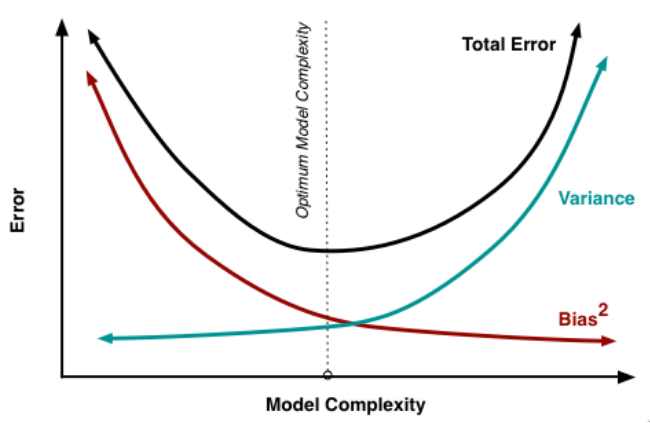
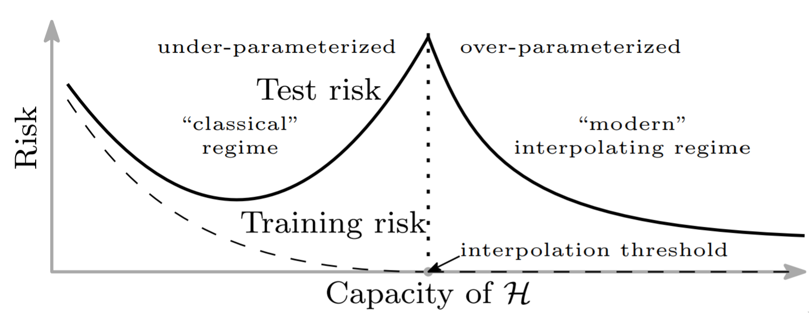

_(Last updated: 2021-04-22)_

Arguably one of the most important concepts in machine learning, taught in
any introductory course, is under- and overfitting. The story goes like this:
if your model is too simplistic, you won't be able to fit the data
well and get a large error, you _underfit_. On the other hand, if your model is too complex,
it will fit any noise that is present in the data, i.e. you _overfit_.
Such a model won't generalize to the test set, so you also get a large error.
Somewhere in between those two is a sweet spot with minimal test error.

The choice of words, under- and overfitting, already implies that we believe
a tradeoff exists: they are two ends of a scale, and we need to find the point
in the middle where we're neither under- nor overfitting too much.

Under- and overfitting can be formalized using the notions of bias and variance
(there'll be a short recap in the next section). Underfitting means that we have
a high test error because of high bias, while overfitting means that high variance
causes a high error. Phrased in those terms, the tradeoff between under- and overfitting
becomes the _bias-variance tradeoff_: methods with low bias tend to have high variance
and vice versa.

This idea is ubiquitous in machine learning. So when I recently wanted to look
up some details, I expected to find troves of information. Tons of empirical evidence,
a formal definition of what exactly we mean by "tradeoff", and hopefully even
theorems showing that this tradeoff exists. As you can tell from the setup,
that's not what happened. So in this post, I'm going to describe what I found
(and what I did not find). My goal is to clear up some potential misconceptions,
and hopefully convince you that the bias-variance tradeoff is less simple and more
interesting than you thought.

## Primer: Bias and variance

Under- and overfitting can be explained in terms of bias and variance.
I'm going to discuss everything in a supervised learning setting. So the setup
is the following:

-   There is a true (unknown) function $f(x)$, which we want to approximate
-   We have a dataset $D = \{(x_1, y_1), \ldots, (x_n, y_n)\}$ of datapoints
    that we use to learn an approximation, where $y_i = f(x_i)$
-   We have some training process that takes in this dataset $D$ and produces
    a function $\hat{f}(x; D)$ that approximates $f(x)$
-   Finally, we imagine there is some distribution over datasets $D$. This
    distribution is unknown an it's a somewhat elusive concept, but think of it
    like this: we created our dataset with some process, e.g. by taking lots of
    photos and then having people label them. The distribution over datasets
    describes how likely this process is to produce any particular dataset.

Now we can define precisely what we mean by bias and variance:

-   The bias is the difference between the expected value of $\hat{f}(x; D)$
    and the true value $f(x)$, i.e.
    $$
    \mathbb{E}_D[\hat{f}(x; D)] - f(x)
    $$
-   By "variance" we mean the variance of $\hat{f}(x; D)$ with respect to $D$, i.e.
    $$
    \mathbb{E}_D \left(\mathbb{E}_D[\hat{f}(x; D)] - \hat{f}(x; D)\right)^2
    $$

Ideally, we want both bias and variance to be small. The reason is the _bias-variance decomposition_
of the expected squared error[^1]:
$$\mathbb{E}_D (\hat{f}(x; D) - f(x))^2 = \text{bias}^2 + \text{variance}$$
Assuming we ultimately want to minimize this expected squared error, it's clear
that all else being equal, we prefer methods with low bias and variance.

Ok, now what about the tradeoff between bias and variance? The idea is that methods
with low bias tend to have high variance, and those with low variance
tend to have high bias. So we can't get both low bias and low variance, instead we
need to find a tradeoff between the two, such that the expected squared error is minimized.
This is illustrated by the following figure (from [this essay](http://scott.fortmann-roe.com/docs/BiasVariance.html), which I recommend if you want
to gain more intuition about bias, variance, and their tradeoff):

If we use an overly simplistic method, we have a high bias because
our model just can't get close to the true function $f$, no matter what we feed
in as training data. With a more complex model, we can fit the true function better,
but the trained model $\hat{f}$ also depends a lot more on the training data $D$,
so the variance increases.

This explanation sounds sort of intuitive, but I find it a bit unsatisfying. Why exactly
do complex models vary more depending on the training data? When does this hold? Can I have
a theorem, please? And what is this "model complexity" anyways?

## A non-answer

Unfortunately, the bias-variance _decomposition_ and the bias-variance _tradeoff_ are often conflated somewhat,
so let's get one thing out of the way: the bias-variance decomposition is not
an explanation for the tradeoff (even though some handy-wavy explanations
suggest this with varying degrees of explicitness). The only way this could
work is if the total error was constant; this would indeed imply a tradeoff between
bias and variance. But it clearly isn't constant (neither in the figure
above, nor in practice). If the total error _was_ constant,
then we wouldn't care about the tradeoff between bias and variance: it wouldn't
matter which model we chose.

Instead, the bias-variance decomposition just motivates why we care about bias
and variance at all. So it explains why the bias-variance tradeoff is important, but it can't
explain why it's a thing in the first place.

## Evidence for a tradeoff

Why do we believe in a tradeoff between bias and variance? Well, I mainly do because
others have told me about it and it seems pretty intuitive. But those aren't very good
reasons, so what to we have in terms of hard evidence?

As an example, let's look at what _Elements of Statistical Learning_ by Hastie et al.
has to say. It considers two cases in Section 7.3: k-NN regression and linear regression.
For k-NN, it gives a theoretical expression for bias and variance, and at least the variance
does indeed increase with increasing model complexity (i.e. decreasing $k$).
A caveat is that the formula assumes the input points $x_i$ are fixed and
only the targets $y_i$ vary -- a very strong and usually unrealistic assumption.
Similarly, there are theoretical expressions in the case of ridge regression,
and based on those, variance should typically decrease and bias increase with
stronger regularization. In the same section, there are small toy experiments
that demonstrate a tradeoff empirically for k-NN and for linear models.

This seems to be fairly representative of the kind of evidence we currently
have in favor of a tradeoff. If you are curious you should look at Section 3.4 in
[this thesis](https://arxiv.org/pdf/1912.08286.pdf), which is more comprehensive than I'm going to be in a blog post.
But in brief, there is empirical evidence for methods such as decision trees,
fitting polynomials, or kernel regression. Then there are some general theoretical
results that are weak evidence for a tradeoff if you squint a bit. And that's pretty
much it.

If you are one of the two or three people working with neural networks,
this doesn't really inspire confidence. After all, the fact that something holds for linear
regression and polynomials isn't very strong evidence that it's also true
for a 25 million parameter ResNet. Which brings us to the question: _does_ the bias-variance
tradeoff exist outside the simple methods named above?

## Double Descent

Over the last few years, the bias-variance tradeoff has ben supplemented by
a more complicated narrative, dubbed "Double descent" by [Belkin et al.](https://arxiv.org/abs/1812.11118) in 2018.
The following figure illustrates this concept:

On the left, we have the classical U-shaped curve for the squared error already shown above.
But the claim is that if you increase the model complexity past the interpolation
threshold, where the model can perfectly fit the training data, then the error
decreases again.

There is quite a bit of empirical evidence for this double descent curve,
especially in the context of [neural networks](https://arxiv.org/abs/1912.02292)[^2]. The reason seems to be
that the variance curve [is](https://arxiv.org/abs/2002.11328) [unimodal](https://arxiv.org/abs/1810.08591), i.e. it first increases with model
complexity, as we'd classicaly suspect, but then decreases again. Of course
that just passes the buck: why does the variance decrease again after the
interpolation threshold?

I think that this is an extremely interesting question, but in this post
I'm not going to speculate on it. Instead, I'm still interested in the bias-variance
tradeoff in the classical regime: as long as the model complexity is below the interpolation
threshold, does a tradeoff always exist? If so, why? If not, when does it exist?
Understanding this question better should also help understanding the behavior
beyond the interpolation threshold: if we really understood why the tradeoff exists
at all, we would also know how it could potentially be violated.

## General theorems are hard

In an ideal world, we could give a formal statement of the bias-variance tradeoff
and then prove that it occurs under some fairly general circumstances.
Maybe that is indeed possible, but it's easy to rule out the most general kinds
of theorems through a few counterexamples.

The strongest form of bias-variance tradeoff would be the claim
"any decrease in variance leads to an increase in bias" (and vice versa).
This is clearly false. For example, let's say we start with a traing procedure that chooses
$\hat{f}(x; D) = \operatorname{sha1}(D)$, i.e. which uses a hash of (some serialization of)
the training data for its prediction (there's nothing special about this example,
just think "a really ridiculous training procedure").
This procedure has high variance, but also high bias. Switching
to any reasonable training procedure will decrease both considerably.

But let's consider a more reasonable statement of the bias-variance-tradeoff:
assume we have a class of models, and the training procedure picks the model from that
class that has the lowest training error. We now want to know how the choice of
model class influences bias and variance. Furthermore, we only consider a nested
set of model classes. So we have an ordering of model classes from simple to complex,
where successively more complex classes contain the simpler ones.

Note that this is a rather typical example of what we mean when
we talk about "model complexity" and the bias-variance tradeoff in practical
contexts. For example, a wider neural network can always instantiate any function
that a more narrow one can, by having some weights be zero.

In this setting, the bias-variance tradeoff can be formulated as two separate claims:
the bias decreases with increasing complexity, while the variance increases.
Unfortunately, neither one is true in general.

A case where bias increases is easy to construct: Let's say the inputs $x$ and
the targets $y$ are both real numbers, and there is some noise, i.e. $y = f(x) + \varepsilon$,
with $\mathbb{E} \varepsilon = 0$. One very simple model class is $\{f\}$, and
this class of course leads to a bias of zero. Then there is a more complex model
class $\{f, f + 1\}$, where we have added a model that always predicts one more
than $f$. Because of the noise, we might get unlucky with the training data and
pick this second model. So this more complex model class has non-zero bias.

A slight modification leads to an example where variance decreases with model
complexity: we take $\{f - 1, f + 1\}$ as the simple model class and $\{f - 1, f, f + 1\}$
as a larger class. Assuming that we have a very large amount of training data,
we will almost always pick $f$ in the second case, so the variance will be very
low. In contrast, in the first case, we pick each of $f - 1$ and $f + 1$ half the
time, so we have a constant variance, no matter how much training data we have.

Note that this decrease in variance
happens in the classical regime, in the sense that in either case, there is
at most one model that fits the data perfectly. So we haven't crossed the
interpolation threshold yet, and still the variance went down when we increased
model complexity.

Obviously, these examples are somewhat silly, and certainly not representative
of real-world scenarios. They do not constitute a good argument that there is no
bias-variance tradeoff in practice, but they do put some limits on what kinds of
bias-variance tradeoffs we can _prove_. So we'll have to put in a bit of work into
finding the right formalization of what we mean by "bias-variance tradeoff", and
in particular when this tradeoff is supposed to hold. As far as I'm aware, such
a formalization does not exist yet.

## Model complexity

Formalizing the bias-variance tradeoff probably also requires formalizing the
notion of "model complexity" to some extent. This is a somewhat elusive
concept, with many different aspects of the training procedure falling under
its umbrella. The prototypical example of model complexity is the size of the
class of models we use. For example, increasing the width of a neural network,
or using a larger basis of features for linear regression, both increase
the size of the model class under consideration.

But the size of the model class is not the entire story. For example,
regularization terms in the loss function don't change the model class but instead affect which model
is selected from that class. The same is true for the number of trainings steps,
or more generally the optimization procedure.

[Nakkiran et al.](https://arxiv.org/abs/1912.02292) define the _effective model complexity_
of a training procedure as the maximum number of training points for which the
expected training error remains below some threshold $\varepsilon$.
That definition captures a lot of my intuition about what we mean by "complexity"
in the context of the bias-variance tradeoff. On the other hand, it seems slightly
ad-hoc and I'm still hoping for an even better notion of model complexity.

One thing that comes to mind when talking about "complexity" is of course Kolmogorov
complexity. But note that
we don't want the (expected) Kolmogorov complexity of the learned model.
For example, a randomly initialized neural network has high Kolmogorov complexity,
but its model complexity should be zero (it's all the way at
"high bias, low variance[^3]"). What we might be able
to use instead is the algorithmic mutual information between the learned
model and the dataset. Another approach would be the (information-theoretic)
mutual information of dataset and model with respect to the distribution over datasets.
Both of these would probably be hard to estimate in practice (and I haven't
thought very long about whether they make sense theoretically and intuitively).
But they illustrate the type of more fundamental definition that I'm hoping exists.

Whether a good definition of model complexity would lead to a formalization
of the bias-variance tradeoff is not clear. For example, just
saying "bias/variance decreases/increases with increasing effective model
complexity" doesn't work (the examples from the previous sections are still
counterexamples). But at least I suspect that having the right notion
of model comlexity is _necessary_ for finding a general formal statement
about the bias-variance tradeoff, even if we then need additional conditions,
under which it holds (for example that it is only true in the classical regime,
i.e. when the model isn't overparameterized).

## Conclusion

After putting the bias-variance tradeoff under a lot of scrutiny, I also
want to emphasize the other side of the coin: it's clear that the bias-variance tradeoff
is real, that it appears in many different settings, and that it's extremely important
to keep in mind when doing machine learning.

But I do think that we don't understand it nearly as well as we could, and that
the way the tradeoff is often presented doesn't do a good job of hightlighting
the parts we don't understand. I highly recommend [this essay](https://www.bradyneal.com/bias-variance-tradeoff-textbooks-update), which makes a similar
point more explicitly.

[^1]: I'm ignoring label noise here. More generally, if the labels are sampled from $y = f(x) + \varepsilon$ with $\mathbb{E}[\varepsilon] = 0$, there would be an additional $\varepsilon^2$-term, the _irreducible error_.
[^2]: Though just to make things even weirder: this only seems to occur when increasing the _width_ of networks. Increasing the depth often isn't tested in papers on the topic, and when it is, there's no double descent curve.
[^3]: To forestall potential confusion: the variance _with respect to the training data_ is low. Of course there is high variance with respect to the random initialization itself, but that's not what we're interested in.
