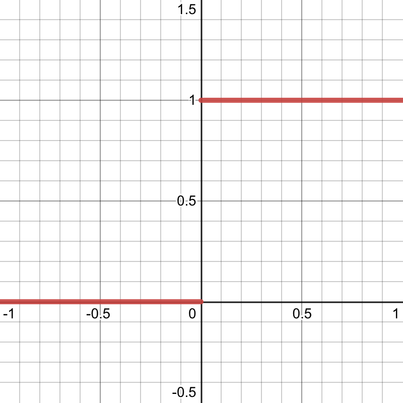

[Last time](/post/distributions-intro), we introduced *Schwartz distributions*.
Let's briefly recap: a distribution is a function that maps certain types
of functions to real numbers. We write $\mathcal{D}(U)$ for the space of
(compactly supported, smooth) functions on a space $U \subseteq \mathbb{R}^n$,
called *test functions*. Distributions are continuous linear maps
$T: \mathcal{D}(U) \to \mathbb{R}$, and we write $\mathcal{D}'(U)$
for the space of these distributions.

An important aspect of distributions is that they generalize functions
$f: U \to \mathbb{R}$. This is not obvious at first---distributions have an
entirely different type signature after all, so how can they be a generalization?
What we mean by that is that there is a natural way to embed the space of (locally
integrable) functions on $U$ into the space of distributions $\mathcal{D}'(U)$.
Namely, each function $f: U \to \mathbb{R}$ induces a distribution $T_f$ defined
by
$$\langle T_f, \varphi \rangle := \int_{U} f\varphi d\lambda^n.$$
Here, $\langle T_f, \varphi \rangle$ is just a commonly used notation for
$T_f(\varphi)$, i.e. the distribution $T_f$ applied to the function $\varphi$.

For "classical" functions, we can do things like add them, convolve them,
take their derivative, and many other operations. 
Given that distribution generalize classical functions, it's natural to ask
whether we can also generalize these operations. It turns out that this
is possible in a (to me) surprising number of cases, in a surprisingly
simple way!

## Addition
Let's start with a warm-up: just like we can add classical functions,
we can add two distributions $S$ and $T$. Specifically, we define $S + T$
as the distribution given by
$$\langle S + T, \varphi \rangle := \langle S, \varphi \rangle + \langle T, \varphi\rangle.$$
In general, this will be how we define distributions: we just say how to
evaluate them on an arbitrary function $\varphi$. If this were a math textbook,
we'd also have to show that the distributions we define this way are indeed
continuous and linear in $\varphi$, but since this is a blog post, we'll
skip that part. The goal here is only to get a good understanding of the definitions.

Now we get to an important theme for this post: we've just defined addition
of distributions, but does this definition really *generalize* the definition
for classical functions? In other words: say we have two functions $f$ and $g$,
both from $U$ to $\mathbb{R}$. There are now two things we could do:
1. Add $f$ and $g$ as functions, then turn the result into a distribution, i.e. $T_{f + g}$.
2. Turn $f$ and $g$ into distributions, then add them as distributions, i.e. $T_f + T_g$.

We really, really want 1. and 2. to be equivalent! This is a good example
of how definitions in math can be good or bad: in principle, we're free to
define addition of distributions however we want---but if our definition
doesn't generalize the definition we already use for classical functions,
then it will be really hard to work with and probably just not useful.

Luckily, it's easy to check that our definition is a good one: we have
$$\begin{aligned}
\langle T_{f + g}, \varphi\rangle &= \int_U (f + g)\varphi d\lambda^n\\\\
&= \int_U f\varphi d\lambda^n + \int_U g\varphi d\lambda^n\\\\
&= \langle T_f, \varphi \rangle + \langle T_g, \varphi\rangle\\\\
&= \langle T_f + T_g, \varphi\rangle.
\end{aligned}$$
This implies that $T_{f + g} = T_f + T_g$ (since distributions are themselves
just functions, and if two functions are equal on all inputs, they're the same).

## Derivatives
Addition was pretty easy, but how are we supposed to define derivatives
of distributions? This seems really hard at first. Do we need some kind of
limit of finite differences, like for classical functions? But what
are these finite differences supposed to look like? 

Recall that in Part I, we used the powerful tool of Wishful Thinking:
just pretend that distributions behave like classical functions,
calculate a bit, and then use the result as the definition.

We're now in a better position to understand what is actually going on there.
Our central demand of any new definition is that it should generalize
the corresponding definition for classical functions. In the case of
derivatives, this means we want
$$\partial_i T_f = T_{\partial_i f}$$
for all functions $f$. ($\partial_i := \frac{\partial}{\partial x_i}$ is the
$i$-th partial derivative). So let's just consider the special case
of distributions that are induced by classical functions for now
(this is the "pretend that distributions behave like functions" step).
We then have
$$\begin{aligned}
\langle \partial_i T_f, \varphi\rangle &= \langle T_{\partial_i f}, \varphi\rangle\\\\
&= \int_U (\partial_i f) \varphi d\lambda^n\\\\
&= -\int_U f (\partial_i \varphi) d\lambda^n\\\\
&= -\langle T_f, \partial_i \varphi\rangle.
\end{aligned}$$
We used integration by parts here, and made use of the fact that $\varphi$
is compactly supported and $U \subseteq \mathbb{R}^n$ is open, so the boundary
term vanishes.

And now comes the second part of the Wishful Thinking strategy: let's just
forget that we restricted ourselves to distributions induced by classical
functions, and instead *define* derivatives this way for all distributions.
More specifically, we just need to replace $T_f$ by $T$ in the equation above,
and get our definition:
$$\langle \partial_i T, \varphi\rangle := -\langle T, \partial_i \varphi\rangle.$$
Voilà, that's our definition for derivatives of distributions! By construction,
this definition extends the one for classical functions, that was the entire
point of our calculation.

One cool thing to note here is that since the test function $\varphi$
is infinitely differentiable (by assumption), *so are distributions*!
Since distributions generalize classical functions, this means we can
take derivatives of functions that we'd normally call non-differentiable.
But the crux is that this derivative will not necessarily itself be a function.
For example, the derivative of the following step function is the delta
distribution that we saw in Part I:

The delta distribution is *not* induced by any function, as we discussed back then.

## Convolutions
We know the recipe now, so let's just run through two more examples,
starting with convolutions. As a quick reminder, the convolution of two
functions $f$ and $g$ is defined as the function $f * g$ given by
$$(f * g)(x) := \int_U f(y)g(x - y)dy.$$

In this post, we'll just look at convolving a distribution with a classical
function (rather than convolving two distributions). To do that, let's introduce
some notation: write $\check{g}$ for the reflection of a function $g$, i.e.
$\check{g}(y) := g(-y)$. Furthermore, we write $\tau_x g$ for the function $g$
shifted by $x \in \mathbb{R}^n$, i.e. $(\tau_x g)(y) := g(y - x)$.
Then note that we can write the term from the convolution above as
$$g(x - y) = \check{g}(y - x) = \tau_x\check{g}(y).$$

The point of this is that we can now rewrite the definition of a convolution as
$$(f * g)(x) := \langle f, \tau_x \check{g}\rangle,$$
without explicitly writing out an integral. And this definition again has a form
that suggests a straightforward generalization to the case where $f$ is replaced
by a distribution, namely
$$(T * g)(x) := \langle T, \tau_x \check{g}\rangle.$$
So the convolution of a distribution with a function is again a classical function
(we evaluate it at points $x \in \mathbb{R}^n$, rather than on test functions).

## Fourier transforms
We'll finish with a pretty cool operation: even Fourier transforms work for
distributions. Well, at least for *some* distributions, we'll get back to that
in a moment. First, let's recall the definition of the Fourier transform
for functions: the Fourier transform of a function $f$ is again a function,
$\mathcal{F}(f)$, given by
$$\mathcal{F}(f)(\xi) := (2\pi)^{-n/2}\int_U f(x) \exp(-ix \cdot \xi)dx.$$
(There are other definitions that differ slightly, but we'll go with this one).

We want to define the Fourier transform $\mathcal{F}(T)$ of a distribution $T$,
so we need to define $\langle \mathcal{F}(T), \varphi\rangle$
for arbitrary test functions $\varphi$. Let's assume again that our distribution
is induced by a function, i.e. $T = T_f$ for some function $f$. In this case,
we want our new definition to extend the old one, i.e. $\mathcal{F}(T_f) = T_{\mathcal{F}(f)}$. That gives us

$$\begin{aligned}
\langle \mathcal{F}(T_f), \varphi\rangle &= \langle \mathcal{F}(f), \varphi\rangle\\\\
&= \int_U \left((2\pi)^{-n/2}\int_U f(x)\exp(-ix \cdot \xi)dx\right)\varphi(\xi)d\xi \\\\
&= \int_U\left((2\pi)^{-n/2}\int_U \phi(\xi) \exp(-i\xi \cdot x) d\xi\right)f(x)dx\\\\
&= \langle f, \mathcal{F}(\varphi)\rangle.
\end{aligned}$$

The final step should be familiar by now: we use this result, which we derived for functions, as the *definition* for general distributions:
$$\langle \mathcal{F}(T), \varphi\rangle := \langle T, \mathcal{F}(\varphi)\rangle.$$
