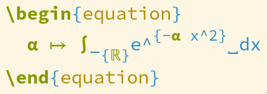

The purpose of this post is to point you towards some great features
and packages if you're already using Emacs to edit LaTeX, and to
make you jealous if you're using some other editor[^1].

This isn't a tutorial for Emacs or even a tutorial on how to write LaTeX inside
Emacs. Rather, it's supposed to give an idea of what's possible, either
as inspiration or to convince you to give Emacs a try. One problem is
that setting all of this up can be a huge time sink, so you might want
to use a framework such as [Doom](https://github.com/hlissner/doom-emacs), where you just need to enable the LaTeX
module and get almost everything I describe here.


## The basics

Of course you get all the basics you would expect from a LaTeX editor.
Synctex is supported (meaning you can jump from a certain line in the
LaTeX code to the corresponding place inside your PDF viewer and the other
way around), you can compile files from inside emacs, you can jump to
compilation errors if there are any, there is auto-completion and so on.


## Visuals

LaTeX can produce beautiful documents, but the source code isn't very
readable when writing mathematical expressions:

```latex
  \alpha \mapsto \int_{\R}e^{-\alpha x^2}\,dx
```

Emacs and AUCTeX (which is the de-facto standard package for using LaTeX inside
Emacs) have several features that improve this situation:

-   `preview-latex` replaces equations (and other parts of the LaTeX document)
    with images by compiling them. This means they look exactly the same inside
    the editor as they will in the compiled document. When the cursor is on
    an equation, this image preview is automatically replaced by the underlying text so you can
    still easily edit equations. However, this method of course has a noticeable
    delay because it requires a call to the LaTeX compiler.
-   LaTeX superscripts and subscripts are displayed as super-/subscripts inside the editor.
    This is a purely visual feature, editing them doesn't require "entering" or "exiting"
    the subscript or anything like that.
-   `prettify-symbols-mode` allows you to replace any string with any unicode symbol.
     AUCTeX comes with a fairly comprehensive predefined list, which replaces LaTeX commands
     such as greek letters, arrows and others with symbolic representations. But you
     can also add your own. For example, the example above uses `\R`, which my custom style
     file defines as `\mathbb{R}`, and it's possible to add replacement rules for such custom
     commands (as long as there is a fitting Unicode symbol). This makes the line above
     look like this in my editor:
    
     When the cursor moves over one of those Unicode symbols, it is expanded to the underlying
     text. And the nice thing about this is that it's essentially instantaneous because nothing
     needs to be compiled.
-   _Folding_ is something similar but more general (though unlike `prettify-symbols-mode` it's specific to LaTeX).
    It doesn't just allow replacing fixed strings but also more complicated
    expressions. By default, this is used for example to display `\label{some_label}` as `[l]`
    (which as always expands when the cursor moves over it). The reasoning here is that
    some elements such as labels are just distractions when reading LaTeX source code.
    But you can also use this to further improve how math is displayed, see
    [this config](https://tecosaur.github.io/emacs-config/config.html#editor-visuals) for some ideas (and in general for more ideas on how to
    beautify LaTeX inside Emacs).


## Editing

AUCTeX has a couple of nice features that make typing LaTeX a bit easier.
For example, you can let it automatically insert braces `{}` when typing `_` or `^`
inside a math environment, you can let it insert `\(\)` when typing a dollar sign,
and even `\enquote{}` when typing `"`&nbsp;[^2].

But things get even better with the [`evil-tex`](https://github.com/iyefrat/evil-tex) package. As the name suggests,
this is only relevant if you're using `evil-mode` (vim keybindings inside emacs),
but if so, it's definitely worth trying. Just a few examples of what this allows
you to do:

-   Say you've typed

    ```latex
        $ax^{2} + b$
    ```

    and suddenly realize that this is supposed to go into an exponent. With your cursor
    anywhere on this math environment, type `ysim^` ("surround everything inside the math
    environment as an exponent") and you'll get

    ```latex
        $^{ax^{2} + b}$
    ```

    with the cursor at the `^`. Now you just need to enter the base.
-   Your equations is now

    ```latex
        $e^{ax^{2} + b}$
    ```

    and you decide that this merits its own displayed rather than
    inline equation. So you type `csmee` ("change the surrounding math environment
    to `equation`") and get

    ```latex
        \begin{equation}
        e^{ax^{2} + b}
        \end{equation}
    ```

-   After a bit more editing, you have (for some reason)

    ```latex
        \begin{equation}
        \beta(e^{ax^{2} + b} + \frac{1}{x})
        \end{equation}
    ```

    Of course this looks ugly in the compiled document, you need to use `\left(` and `\right)`.
    With `evil-tex`, you can just type `mtd` ("toggle delimiter") with the cursor anywhere
    inside the parantheses, and it will add `\left` and `\right` for you. Type `mtd` again to
    go back to just the parantheses.


## Emacs calc's embedded mode

`calc` is the built-in calculator for Emacs; though saying "calculator"
is a bit misleading because it can do symbolic differentiation, unit conversion,
linear algebra and more. If your press `C-x * e` with your cursor on any LaTeX equation,
you will start `calc` in "embedded mode". This means that `calc` will parse the LaTeX
code and then let you do any calculations you want involving the expression.
The result will automatically be converted back to LaTeX and written into the
buffer.

For example, say you have

```latex
$$
\sin\left( x^2 + \sqrt{x} \right)
$$
```

and want to know the derivative. You can enter embedded mode and type `ad` to differentiate,
then type `x` when prompted for the variable with respect to which to differentiate.
And just like that, you will have

```latex
$$
\left( 2 x + \frac{0.5}{\sqrt{x}} \right) \cos\left( x^2 + \sqrt{x} \right)
$$
```

inside your buffer. `calc` can even parse and output things like `\begin{pmatrix}...\end{pmatrix}`,
so you can multiply matrices as well.


## And more

I've only covered some of my personal favorite features when it comes to
writing LaTeX inside Emacs, there's much more. For example, `LaTeX-math-mode` allows
you to very quickly enter mathematical symbols and RefTeX as well as other packages
make handling references, labels and citations very efficient.
And of course there are a gazillion other packages that can make writing LaTeX
easier -- this is Emacs after all.

The downside is of course that there is a pretty steep learning curve.
But for people who need to write LaTeX documents all the time, I'd argue
it's worth it.

[^1]: Though mostly the first part -- I haven't actually tried many others and they may be just as amazing.
[^2]: Using `TeX-electric-sub-and-superscript`, `TeX-electric-math`, and `LaTeX-csquotes-open-quote` / `LaTeX-csquotes-close-quote`
