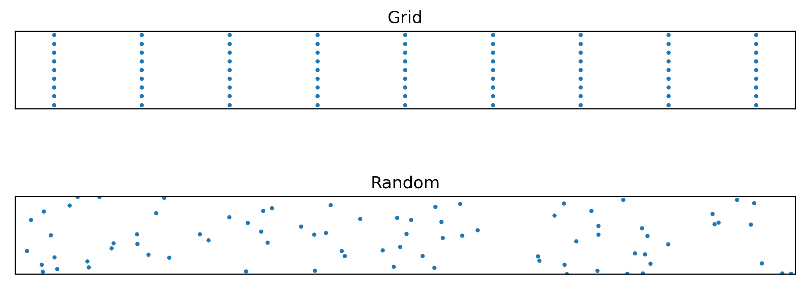

The following figure[^1] is a good illustration of why random search
typically works better than grid search for hyperparameter optimization:

The idea here is that the performance depends on two hyperparameters,
$x$ and $y$, and one of them ($x$ in this case) is much more important.
More specifically, the performance can be written as $f(x) + g(y)$,
where $f(x)$ is the green curve at the top and $g(y)$ the yellow curve
on the side.

Both random and grid search test 9 different $(x, y)$ pairs. But random
search also tests 9 different values of $x$, whereas grid search tests only 3.
So since the $x$-dependency dominates overall performance, random search
will very likely find a better parameter combination.

I'd like to show another visualization of this idea,
by stretching the space of hyperparameters to illustrate their relative
importance.

If we have two hyperparameters that are equally important to overall
performance, grid and random search look as follows:

You should imagine that the best hyperparameter combination lies at some unknown
point in these squares. The goal is to have tested at least one point relatively
close to this optimum.[^2] Grid search is looking pretty good from that perspective.

But this figure is very misleading if one of the parameters is much more important
than the other. In that case, we care a lot more about the distance along
the important axis. We can visualize this by stretching the space of hyperparameters
so that the more important hyperparameter has a longer axis:

In this stretched figure, we can just look at distances without worrying
about the different axes, because the geometry of the space already takes
the relative importance of the two hyperparameters into account.

Suddenly, grid search doesn't look that great anymore, and random search is actually
better at "uniformly" filling out the hyperparameter space under this new geometry.

If we knew the relative importance of the two hyperparameters,
we could improve grid search by having more grid points along the more important
axis---but often we *don't* know that, at least not very precisely. And
for random search, it luckily doesn't matter.

[^1]: James Bergstra and Yoshua Bengio: Random Search for Hyper-Parameter Optimization, https://www.jmlr.org/papers/volume13/bergstra12a/bergstra12a.pdf

[^2]: This is a different sort of simplifying assumption
than we had above: now, the overall performance cannot necessarily be decomposed
as $f(x) + g(y)$. Instead, we assume that performance depends monotonically
on the weighted distance $a(x - x_{\text{opt}})^2 + b(y - y_{\text{opt}})^2$. Just like the previous assumption
of additivity, this is pretty unrealistic, but I think it still serves as
a good intuition.
